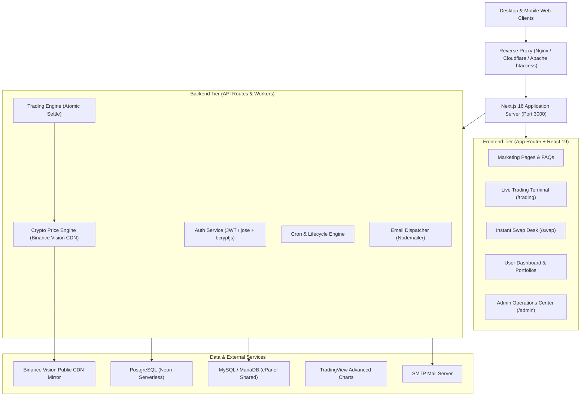

# Architecture & System Design

High-level architecture documentation for the Emporium Capitals application.

---

## 1. System Topology

---

## 2. Security & Session Model

1. **Authentication Token Storage**:
   - `user_token`: Encrypted/Signed JWT stored in `HttpOnly`, `SameSite=Lax`, `Secure` cookies.
   - `admin_token`: Separate admin credential cookie, strictly scoped to `/api/admin/*` and `/admin/*`.
2. **Reverse Proxy Header Normalization (`proxy.js`)**:
   - Resolves `x-forwarded-proto` and `x-forwarded-host` to prevent mixed-content `http://` security warnings on modern SSL deployments.
3. **Idempotency Guard**:
   - Trading orders require or automatically generate an `idempotencyKey` preventing accidental double-order submissions.
4. **Balance Lock**:
   - Trades and withdrawals execute atomic SQL updates (`UPDATE users SET balance = balance - $1 WHERE id = $2 AND balance >= $1 RETURNING ...`) eliminating race conditions.
