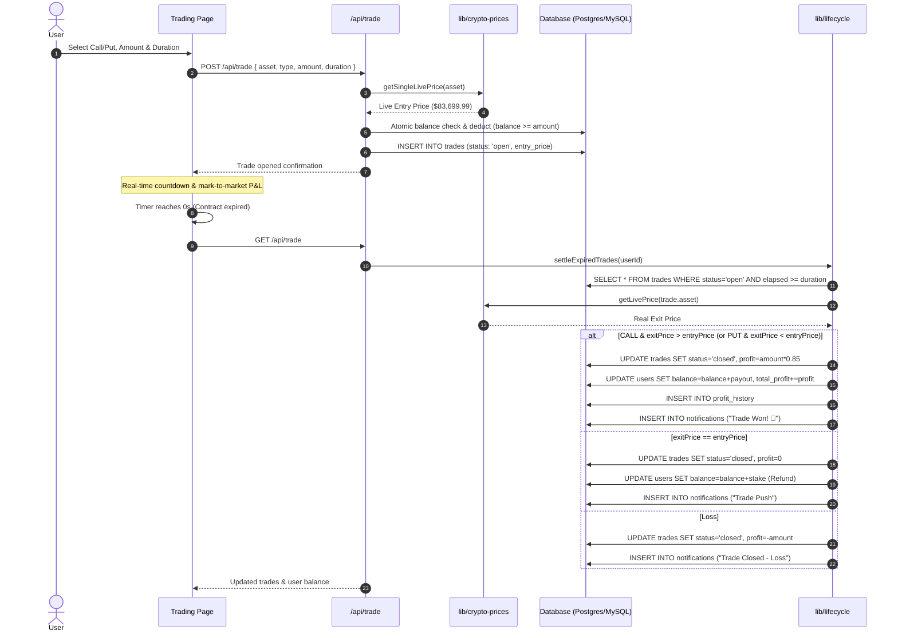

# Real-Time Trading & Crypto Pricing Engine

## Overview

Emporium Capitals features an institutional-grade binary & high-low trading terminal powered by real-time market data directly from global crypto exchange infrastructure.

---

## 1. Real-Time Price Engine (`lib/crypto-prices.js`)

### Primary Market Data Source
- **Endpoint**: `https://data-api.binance.vision/api/v3/ticker/24hr`
- **Fallback Endpoint**: `https://api.binance.com/api/v3/ticker/24hr`
- **Mechanism**: The price engine queries the Binance Vision CDN mirror in a single batch request containing all supported pairs (`BTCUSDT`, `ETHUSDT`, `SOLUSDT`, `BNBUSDT`, `XRPUSDT`, `ADAUSDT`, `DOGEUSDT`, `TRXUSDT`).
- **Resilience**: Unlike standard Binance endpoints which may enforce aggressive geo-blocking or rate limits, the Binance Vision CDN mirror is open, low-latency, and highly reliable.

### Caching & Rate Limit Mitigation
- **In-Memory Cache**: Ticker data is cached in memory with a 3,000ms freshness window.
- **Request Deduplication**: Concurrent requests within the same tick window reuse an active Promise (`ongoingFetchPromise`), preventing duplicate external requests.
- **Fallback Baselines**: If both CDN and API endpoints encounter network failures, the engine falls back to pre-calibrated baseline rates (`STATIC_RATES`), guaranteeing zero runtime crashes.

### Ticker Data Model
Every ticker returned by `getCryptoMarketData()` and `/api/prices` contains:
```typescript
interface CryptoTicker {
  symbol: string;             // e.g. "BTCUSDT"
  shortName: string;          // e.g. "BTC"
  name: string;               // e.g. "Bitcoin"
  price: number;              // Current live price (e.g. 83699.99)
  priceChangePercent: number; // 24h percentage change (e.g. -0.07)
  priceChange: number;        // 24h USD change (e.g. -57.22)
  highPrice: number;          // 24h intraday high
  lowPrice: number;           // 24h intraday low
  bidPrice: number;           // Best market bid
  askPrice: number;           // Best market ask
  spread: number;             // Real-time spread (ask - bid)
  volume: number;             // 24h base asset volume
  quoteVolume: number;        // 24h quote volume (USD/USDT)
  updatedAt: number;          // Epoch timestamp
}
```

---

## 2. Trading Terminal (`app/trading/page.jsx`)

### Supported Assets
| Symbol | Pair | Decimals | Icon | Default Benchmark |
|---|---|---|---|---|
| **BTC** | BTC/USDT | 2 | ₿ | $83,500.00 |
| **ETH** | ETH/USDT | 2 | Ξ | $2,690.00 |
| **SOL** | SOL/USDT | 2 | ◎ | $120.00 |
| **BNB** | BNB/USDT | 2 | ❖ | $755.00 |
| **XRP** | XRP/USDT | 4 | ✕ | $1.5000 |
| **ADA** | ADA/USDT | 4 | ₳ | $0.2500 |
| **DOGE** | DOGE/USDT | 5 | Ð | $0.09500 |
| **TRX** | TRX/USDT | 4 | ₸ | $0.3300 |

### Key Terminal Features
1. **Multi-Asset Ticker Ribbon**:
   - Quick switching across 8 markets.
   - Dynamic tick flashes: green glow for price increases, red glow for price decreases.
2. **Selected Pair Live Header**:
   - Prominent real-time quote, 24h change %, 24h High, 24h Low, Best Bid, Best Ask, and live Spread.
3. **Synchronized TradingView Chart**:
   - Embedded interactive chart (`CoinChartWidget`), synchronized with the selected pair.
4. **Live Order Book & Depth**:
   - Real-time bids, asks, and mid-market spread calculated against live market quotes.
5. **Execution Panel**:
   - **Contract Types**: CALL (Price must rise above entry) / PUT (Price must fall below entry).
   - **Durations**: `1m`, `5m`, `15m`, `30m`, `1h`, `1d`.
   - **Stake Presets**: `+$25`, `+$50`, `+$100`, `+$250`, `+$500`, `MAX` balance.
   - **Instant Payout Preview**: Dynamic 85% return calculation (e.g. $100 stake $\rightarrow$ $185 payout).
6. **Live Positions Monitor**:
   - Second-by-second countdown clock with animated visual progress bar.
   - Real-time mark-to-market status: `IN THE MONEY 🎯` (+85%) vs `OUT OF THE MONEY ⚠️` (-100%).
   - Automated settlement trigger on timer expiration (`0s`).
7. **Trading History & Audit Trail**:
   - Tabular overview of all positions with entry quote, exit quote, net P&L, and status.

---

## 3. Order Lifecycle & Auto-Settlement (`lib/lifecycle.js`)



---

## 4. Crypto Swap Engine (`app/api/swap/route.js`)

Users can instantly swap between any supported cryptocurrencies and stablecoins (e.g. BTC to USDT, USDT to ETH, SOL to BTC).

- **Rate Calculation**:
  $$\text{Target Amount} = \frac{\text{From Amount} \times \text{From Price USD}}{\text{To Price USD}}$$
- **Execution**: Balance deductions and credits are performed atomically within a database transaction or atomic updates with automatic rollbacks.
